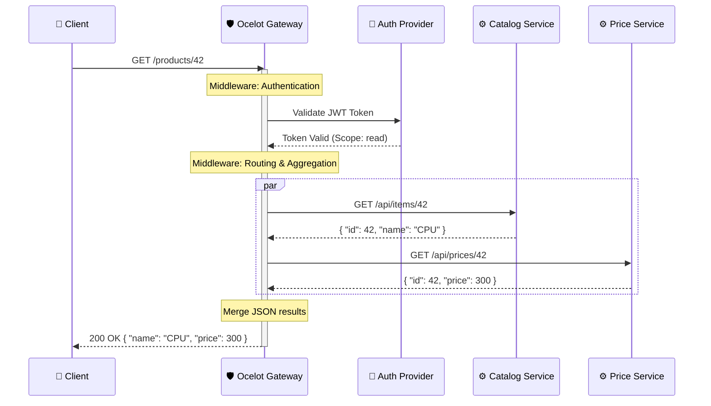

---
aliases:
  - Ocelot API Gateway
  - Шлюз Ocelot
tags:
  - api
  - infrastructure
  - dotnet
date: 2026-03-02 19:54
status:
---
> [!info] Определение
> **Ocelot** — это Open-Source библиотека для .NET, предназначенная для создания легких [[API_Gateway|API-шлюзов]]. Она работает как набор Middlewares в конвейере ASP.NET Core и предоставляет мощные инструменты для маршрутизации, аутентификации и агрегации запросов.

### Философия и задачи
Главная задача Ocelot — быть "единым окном" для [[Microservices Architecture|микросервисной архитектуры]] на стеке [[.NET]]. Он ориентирован на простоту настройки через [[JSON]]-конфигурацию (`ocelot.json`), позволяя разработчикам быстро описывать правила проксирования без написания сложного кода.

---

### Основные возможности (Features)

1. **Routing (Маршрутизация)**: Маппинг входящих (Upstream) запросов на внутренние (Downstream) адреса сервисов.
2. **Request Aggregation**: Возможность за один запрос клиента собрать данные из нескольких микросервисов.
3. **Authentication & Authorization**: Интеграция с [[JWT]], IdentityServer или Auth0 на уровне шлюза.
4. **[[Load_Balancing|Балансировка нагрузки]]**: Поддержка алгоритмов RoundRobin, LeastConnection и CookieStickySessions.
5. **[[Service_Discovery|Обнаружение сервисов]]**: Нативная интеграция с Consul, Eureka или Kubernetes.
6. **QoS (Quality of Service)**: Поддержка **Circuit Breaker** (предохранитель) через библиотеку Polly.
7. **Rate Limiting**: Ограничение количества запросов от конкретных клиентов по IP или ClientId.

---

### Практическая реализация (Конфигурация)

Вся логика Ocelot описывается в файле `ocelot.json`.

#### Структура маршрута (ReRoute):
| Понятие | Описание |
| :--- | :--- |
| **Upstream** | То, что видит клиент (внешний URL, метод). |
| **Downstream** | Куда шлюз перенаправляет запрос (внутренний сервис). |

#### Пример `ocelot.json`:
```json
{
  "Routes": [
    {
      "DownstreamPathTemplate": "/api/inventory/{everything}",
      "DownstreamScheme": "http",
      "DownstreamHostAndPorts": [
        { "Host": "inventory-service", "Port": 80 }
      ],
      "UpstreamPathTemplate": "/inventory/{everything}",
      "UpstreamHttpMethod": [ "Get", "Post" ],
      "AuthenticationOptions": {
        "AuthenticationProviderKey": "Bearer",
        "AllowedScopes": []
      }
    }
  ],
  "GlobalConfiguration": {
    "BaseUrl": "https://api.mycompany.com"
  }
}
```

---

### Диаграмма взаимодействия



---

### Реализация

Для работы Ocelot нужно установить NuGet пакет `Ocelot`.

#### 1. Настройка Program.cs
```csharp
var builder = WebApplication.CreateBuilder(args);

// 1. Добавляем конфигурационный файл Ocelot
builder.Configuration.AddJsonFile("ocelot.json", optional: false, reloadOnChange: true);

// 2. Регистрируем сервисы Ocelot
builder.Services.AddOcelot(builder.Configuration);

// 3. (Опционально) Добавляем аутентификацию
builder.Services.AddAuthentication()
    .AddJwtBearer("Bearer", options => { /* Настройки JWT */ });

var app = builder.Build();

// 4. Используем Middleware Ocelot
// Важно: UseOcelot должен быть последним в конвейере
await app.UseOcelot();

app.Run();
```

---

### Best Practices & Anti-patterns

#### ✅ Do (Как надо)
- **Использование Service Discovery**: В динамических средах ([[Docker]]/K8s) не прописывайте IP-адреса вручную, используйте [[Service_Discovery]].
- **Claims Transformation**: Используйте Ocelot для извлечения данных из токена и проброса их в заголовки (`headers`) внутренних запросов.
- **Модульность**: Если конфигурация становится огромной, используйте `AddOcelot().AddConfigStoredInConsul()` или разделяйте [[JSON]] на части.
- **Кэширование**: Включайте встроенное кэширование (`FileCourse.Cache.OutputCache`) для часто запрашиваемых данных.

#### ❌ Don't (Как не надо)
- > [!warning] Ocelot vs YARP
    > Не используйте Ocelot для задач с экстремально высокой нагрузкой (миллионы RPS). Для максимальной производительности лучше рассмотреть [[NGINX]] или [[YARP]].
- > [!danger] Тяжелые трансформации
    > Не пишите сложную бизнес-логику внутри [[Middleware]] шлюза. Ocelot — это транспортный слой, а не сервис бизнес-логики.
- **Отсутствие таймаутов**: Никогда не оставляйте `QoS` не настроенным — один "повисший" микросервис может забить пул потоков всего шлюза.