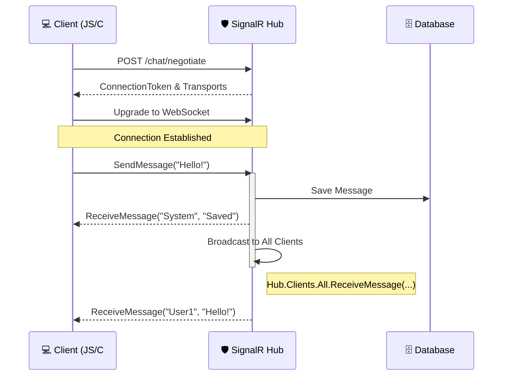

---
aliases:
tags:
  - api
  - architecture
  - dotnet
date: 2026-03-03 17:02
status:
---
> [!info] Определение
> **SignalR** — это библиотека для ASP.NET Core, которая упрощает добавление веб-функциональности в реальном времени. Она позволяет серверному коду мгновенно отправлять уведомления подключенным клиентам по мере возникновения событий на сервере.

### Философия и задачи
Главная задача SignalR — переход от модели **Pull** (клиент опрашивает сервер) к модели **Push** (сервер пушит данные клиенту). Это решает проблему задержек в чатах, финансовых котировках, игровых механиках и дашбордах мониторинга.

---

### Ключевые механизмы и абстракции

#### 1. Транспорты (Transport Fallback)
SignalR автоматически выбирает лучший доступный способ передачи данных, переключаясь на более простые, если среда не поддерживает современные протоколы:
- **[[WebSockets]]**: Полнодуплексный бинарный протокол (лучший вариант).
- **Server-Sent Events (SSE)**: Односторонний поток от сервера к клиенту (используется в браузерах без WebSockets).
- **Long Polling**: Клиент открывает запрос и ждет, пока у сервера появятся данные (крайний случай).

#### 2. Хабы (Hubs)
**Hub** — это высокоуровневый конвейер, который позволяет клиенту и серверу вызывать методы друг друга напрямую (RPC — Remote Procedure Call).
- Сервер может вызывать методы на *конкретном* клиенте.
- Сервер может вызвать метод у *всех* подключенных клиентов.
- Сервер может объединять клиентов в **Группы**.

#### 3. Форматы сообщений
- [[JSON]]: Текстовый формат по умолчанию.
- **MessagePack**: Бинарный формат (быстрее и компактнее).

---

### Практическая реализация

#### Жизненный цикл соединения:
1. **Negotiate**: Клиент запрашивает у сервера доступные транспорты и ID соединения.
2. **Connect**: Установление соединения по выбранному протоколу.
3. **Exchange**: Двусторонний обмен сообщениями.
4. **Close**: Завершение или разрыв связи (с поддержкой автоматического переподключения).

#### Сравнение с обычным [[HTTP]]:
| Характеристика | Обычный API (REST) | SignalR (Hubs) |
| :--- | :--- | :--- |
| **Тип связи** | Request-Response | Bi-directional (Duplex) |
| **Состояние** | [[Stateless]] | Statefull (Persistent Connection) |
| **Инициатор** | Всегда клиент | И клиент, и сервер |

---

### 📊 Диаграмма взаимодействия



---

### Пример 

#### 1. Создание Хаба
```csharp
using Microsoft.AspNetCore.SignalR;

public class NotificationHub : Hub
{
    // Метод, который вызывает клиент
    public async Task SendNotification(string message)
    {
        // Вызов метода "ReceiveMessage" на ВСЕХ подключенных клиентах
        await Clients.All.SendAsync("ReceiveMessage", "System", message);
    }

    // Управление группами
    public async Task JoinGroup(string groupName)
    {
        await Groups.AddToGroupAsync(Context.ConnectionId, groupName);
    }
}
```

#### 2. Регистрация в Program.cs
```csharp
var builder = WebApplication.CreateBuilder(args);
builder.Services.AddSignalR(); // Регистрация сервисов

var app = builder.Build();
app.MapHub<NotificationHub>("/notifications"); // Маппинг эндпоинта
app.Run();
```

---

### Масштабирование (Backplane)

Поскольку SignalR хранит соединения в памяти сервера, в распределенной системе (несколько копий [[API]]) возникает проблема: клиент на Сервере А не получит сообщение, отправленное Сервером Б.

**Решения:**
- **Redis Backplane**: Все серверы обмениваются событиями через Redis.
- **Azure SignalR Service**: Полностью управляемый прокси-сервис, который берет на себя хранение тысяч соединений.

---

### Best Practices & Anti-patterns

#### ✅ Do (Как надо)
- **Используйте Strongly Typed Hubs**: Наследуйтесь от `Hub<ITypedClient>`, чтобы избежать ошибок в именах методов.
- **Группы вместо итерации**: Группируйте пользователей по `UserId` или `ChatId` вместо того, чтобы хранить списки ID соединений вручную.
- **Automatic Reconnect**: Всегда включайте `.withAutomaticReconnect()` на стороне клиента.
- **[[Cancellation Token]]**: Передавайте токены в методах хаба для корректного завершения запросов.

#### ❌ Don't (Как не надо)
- > [!warning] Тяжелые данные
    > Не пересылайте огромные объекты через SignalR. Лучше отправить уведомление "Данные обновились", чтобы клиент сам скачал их через обычный GET-запрос.
- > [!danger] Длительные операции
    > Не делайте `await` долгих расчетов внутри метода Хаба. Это заблокирует соединение. Используйте фоновые задачи ([[Background_Tasks]]).
- **Auth в Query String**: Старайтесь не передавать токены в URL (для WebSockets это иногда необходимо, но используйте заголовки там, где это возможно).