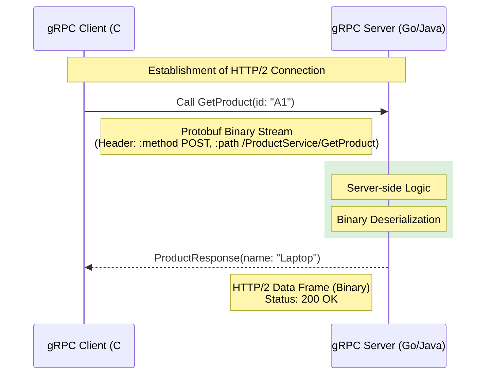

---
aliases:
tags:
  - api
  - architecture
  - DesignPatterns
date: 2026-03-02 19:15
status:
---
# gRPC (Google Remote Procedure Call)

> [!info] Определение
> **gRPC** — это современный высокопроизводительный фреймворк для удаленного вызова процедур (RPC), разработанный Google. Он позволяет клиентскому приложению напрямую вызывать методы на серверном приложении, как если бы это был локальный объект.

### Философия и задачи
Главная задача gRPC — обеспечить максимально быстрое и типизированное взаимодействие между микросервисами. В отличие от [[REST]], ориентированного на ресурсы, gRPC ориентирован на **действия (процедуры)**.

---

### Ключевые ограничения и принципы

1. **[[Protocol Buffers]] (Protobuf)**: Использование бинарного формата сериализации вместо текстового ([[JSON]]/XML). Это уменьшает размер сообщения и ускоряет парсинг.
2. **Основа на [[HTTP]]/2**:
    - **Мультиплексирование**: Передача нескольких запросов по одному [[TCP]]-соединению.
    - **Сжатие заголовков (HPACK)**: Экономия трафика.
    - **Server Push**: Сервер может отправлять данные без явного запроса.
3. **Contract-first (Сначала контракт)**: Сначала описывается интерфейс в `.proto` файле, затем генерируется код для любой платформы.
4. **Типизация**: Строгая проверка типов на этапе компиляции, а не во время выполнения.
5. **Поддержка стриминга**: Нативная поддержка потоковой передачи данных.

---

### Практическая реализация (Методы и Типы)

В gRPC существует 4 типа взаимодействия:

| Тип взаимодействия   | Описание                                             | Использование                            |
| :------------------- | :--------------------------------------------------- | :--------------------------------------- |
| **Unary**            | Один запрос — один ответ (как классический [[API]]). | Обычные CRUD операции.                   |
| **Server Streaming** | Один запрос — поток ответов.                         | Выгрузка тяжелых отчетов, лента событий. |
| **Client Streaming** | Поток запросов — один ответ.                         | Загрузка больших файлов порциями.        |
| **Bi-directional**   | Поток запросов — поток ответов.                      | Чаты, real-time системы, телефония.      |

#### Именование и структура (.proto)
```protobuf
syntax = "proto3";

package catalog;

service ProductService {
  // Unary метод
  rpc GetProduct (ProductRequest) returns (ProductResponse);
}

message ProductRequest {
  string id = 1; // Число — это номер поля (тег), а не значение
}

message ProductResponse {
  string name = 1;
  double price = 2;
}
```

---

### Диаграмма взаимодействия



---

### Пример

#### 1. Реализация сервиса
```csharp
public class CatalogService : ProductService.ProductServiceBase
{
    private readonly ILogger<CatalogService> _logger;
    public CatalogService(ILogger<CatalogService> logger) => _logger = logger;

    // Переопределение сгенерированного метода
    public override Task<ProductResponse> GetProduct(ProductRequest request, ServerCallContext context)
    {
        _logger.LogInformation($"Searching for product {request.Id}");
        
        return Task.FromResult(new ProductResponse
        {
            Name = "Neural Link v2",
            Price = 999.99
        });
    }
}
```

#### 2. Регистрация в Program.cs
```csharp
var builder = WebApplication.CreateBuilder(args);
builder.Services.AddGrpc(); // Добавление инфраструктуры gRPC

var app = builder.Build();
app.MapGrpcService<CatalogService>(); // Маппинг сервиса
app.Run();
```

---

### Best Practices & Anti-patterns

#### ✅ Do (Как надо)
- **Использование Deadlines**: Всегда устанавливайте таймауты (`Deadline`), чтобы клиент не ждал вечно.
- **[[Идемпотентность]]**: Проектируйте методы так, чтобы повторный вызов не ломал систему (особенно в стриминге).
- **Версионирование пакетами**: Используйте `package v1;` в proto-файлах.
- **[[Cancellation Token]]**: Всегда прокидывайте токен отмены в асинхронные операции.

#### ❌ Don't (Как не надо)
- > [!warning] Public-facing API
    > Не используйте gRPC для внешних публичных API (браузеры плохо поддерживают HTTP/2 gRPC без прокси-слоя, например gRPC-Web). Для фронтенда лучше оставить [[REST]] или [[GraphQL]].
- > [!danger] Огромные сообщения
    > Не передавайте файлы по 100Мб в одном Unary-запросе. Используйте **Client Streaming**.
- **Игнорирование статус-кодов**: Не возвращайте ошибку внутри успешного JSON-ответа. Используйте стандартные gRPC Status Codes (OK, NotFound, Internal, и т.д.).