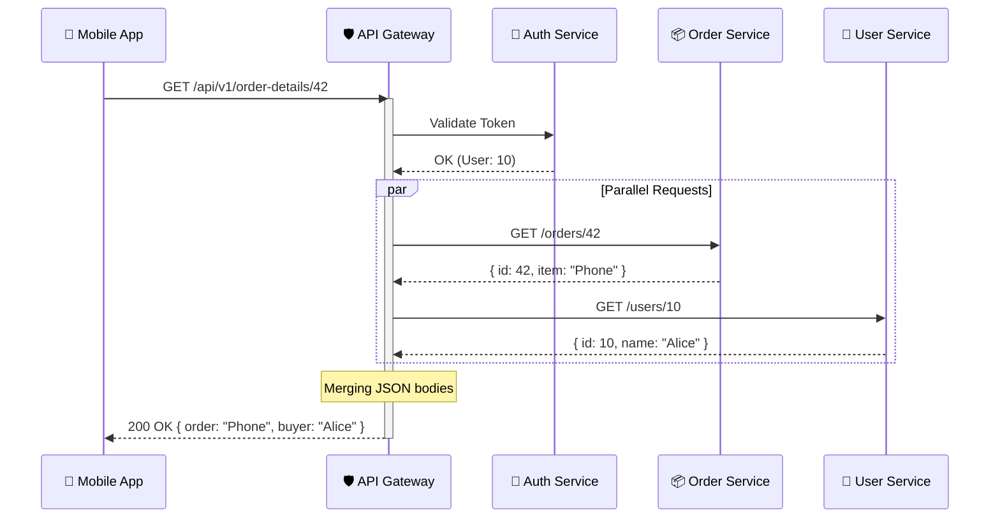

---
aliases:
tags:
  - api
  - architecture
date: 2026-03-02 19:45
status:
---
> [!info] Определение
> **API Gateway** — это сервер, который выступает в роли единой точки входа для всех внешних запросов от клиентов к группе внутренних [[Microservices|микросервисов]]. Он инкапсулирует внутреннюю архитектуру системы и предоставляет API, адаптированный для каждого клиента.

### Философия и задачи
Главная задача API Gateway — **скрыть сложность** распределенной системы. Вместо того чтобы клиент знал адреса десятков сервисов, он общается только с «умной дверью», которая знает, куда направить запрос.

---

### Основные функции (Patterns)

1. **Routing (Маршрутизация)**: Перенаправление запроса на нужный эндпоинт конкретного сервиса.
2. **API Composition (Агрегация)**: Сбор данных из нескольких сервисов и возврат их клиенту одним ответом (уменьшает количество сетевых вызовов).
3. **Offloading (Вынос общей логики)**:
    - Аутентификация и авторизация ([[JWT]], [[OAuth2]]).
    - [[Rate_Limiting|Лимитирование запросов]] (защита от DDOS и перегрузок).
    - Логирование и трассировка.
    - Ответы из кэша.
4. **Protocol Translation**: Например, перевод входящего [[HTTP]]/[[JSON]] запроса во внутренний [[gRPC]] или [[RabbitMQ]] сообщение.
5. **[[BFF (Backend for Frontend)]]**: Создание отдельных шлюзов для разных типов клиентов (Mobile, Web, IoT).

---

### Практическая реализация

API Gateway работает как «умный» [[Reverse_Proxy|Обратный прокси]].

#### Таблица специфичных статусов ответа Gateway:
| Код | Описание | Причина в контексте Gateway |
| :--- | :--- | :--- |
| **401/403** | Unauthorized/Forbidden | Шлюз не пропустил запрос из-за проблем с токеном. |
| **429** | Too Many Requests | Сработал лимит (Rate Limit) для данного клиента. |
| **502** | Bad Gateway | Внутренний сервис упал или недоступен. |
| **503** | Service Unavailable | Превышен лимит соединений или сервис на обслуживании. |
| **504** | Gateway Timeout | Внутренний сервис не ответил вовремя. |

---

### 📊 Диаграмма взаимодействия (Aggregation Pattern)



---

### Патерны развертывания

- **[[Single API Gateway]]**: Один шлюз для всех клиентов (просто, но может стать "узким горлышком").
- **[[BFF (Backend for Frontend)]]**: Отдельный шлюз для Mobile и отдельный для Web. Позволяет оптимизировать данные под конкретный экран.
- **[[Sidecar]] (Service Mesh)**: Взаимодействие через [[Istio]] или [[Linkerd]], где функции шлюза распределены.

---

### Пример (YARP - Yet Another Reverse Proxy)

В современной разработке на .NET стандартным инструментом является **YARP** от Microsoft.

#### Настройка в `appsettings.json`:
```json
{
  "ReverseProxy": {
    "Routes": {
      "orders-route": {
        "ClusterId": "orders-cluster",
        "Match": { "Path": "/api/orders/{**remainder}" },
        "Transforms": [ { "PathRemovePrefix": "/api" } ]
      }
    },
    "Clusters": {
      "orders-cluster": {
        "Destinations": {
          "destination1": { "Address": "http://orders-service:8080/" }
        }
      }
    }
  }
}
```

#### Регистрация в `Program.cs`:
```csharp
var builder = WebApplication.CreateBuilder(args);
// Добавляем YARP в контейнер зависимостей
builder.Services.AddReverseProxy()
    .LoadFromConfig(builder.Configuration.GetSection("ReverseProxy"));

var app = builder.Build();

app.UseRouting();
app.UseAuthentication(); // Шлюз проверяет Auth перед проксированием
app.UseAuthorization();

app.MapReverseProxy(); // Включаем проксирование
app.Run();
```

---

### Best Practices & Anti-patterns

#### ✅ Do (Как надо)
- **Таймауты и Ре retry**: Всегда настраивайте время ожидания и политику повторов.
- **Circuit Breaker**: Если сервис "лежит", шлюз должен сразу возвращать ошибку, не пытаясь его "добить".
- **Correlation ID**: Генерируйте уникальный ID запроса на шлюзе и прокидывайте его во все сервисы для логирования.
- **Версионирование**: Реализуйте `/v1/`, `/v2/` на уровне шлюза.

#### ❌ Don't (Как не надо)
- > [!warning] Бизнес-логика в шлюзе
    > Не пишите в Gateway код расчета скидок или обработки заказов. Шлюз должен только перенаправлять и агрегировать.
- > [!danger] Monolithic Gateway
    > Избегайте превращения шлюза в монолит, который нужно пересобирать при изменении любого микросервиса.
- **Игнорирование безопасности**: Не выставляйте внутренние сервисы в интернет напрямую — доступ должен быть только через Gateway.