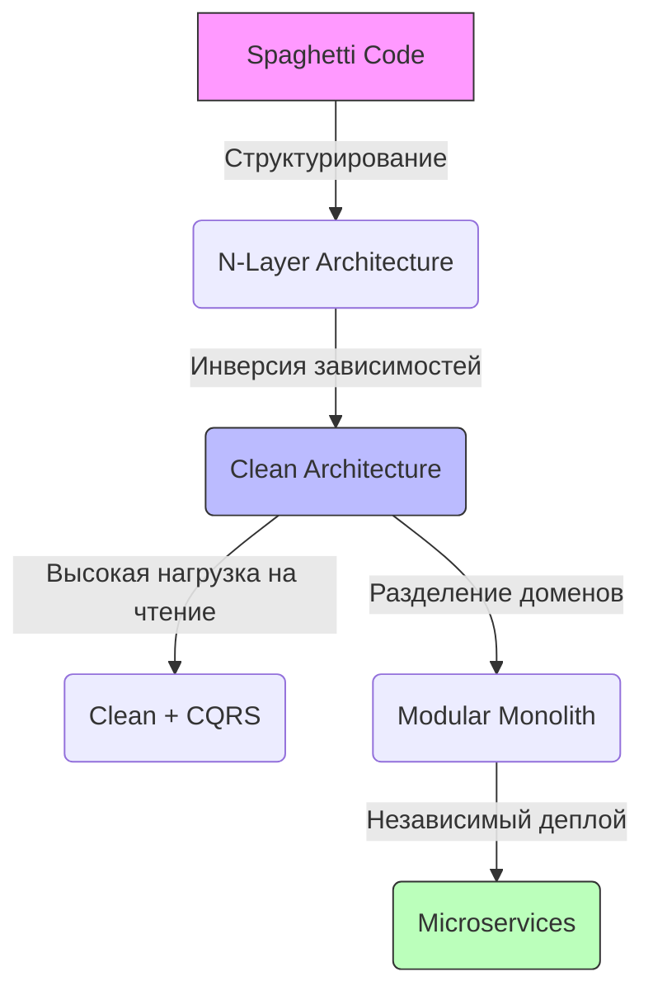

---
aliases:
tags:
  - architecture
  - dotnet
  - DesignPatterns
date: 2026-03-02 14:58
status:
---
### Навигация

1. **[[N-Layer Architecture]]** — Классическая "слоистая" архитектура. Де-факто стандарт для простых CRUD-приложений.
2. **[[N-Tier Architecture]]** — Многозвенная архитектура. Фокус на **физическом** разделении (Deployment).
3. **[[Clean Architecture]]** — Чистая архитектура (Onion/Hexagonal). Инверсия зависимостей для защиты бизнес-логики.
4. **[[CQRS]]** — Разделение ответственности команд и запросов. Оптимизация чтения и записи как отдельных потоков.
5. **[[Microservices Architecture]]** — Распределенная система автономных сервисов. Масштабируемость ценой сложности.
	1. [[API Gateway]] — общая концепция (Routing, Aggregation, Offloading).
	    - [[Ocelot]] — реализация на уровне .NET приложения.
	    - [[NGINX]] — реализация на уровне инфраструктуры (Reverse Proxy / Gateway).
	    - [[Ocelot vs NGINX]] — один работает на уровне инфраструктуры, другой на уровне приложения.
6. [[BFF (Backend for Frontend)]]

---

##  Сравнительная матрица

| Паттерн                            | Сложность реализации | Тестируемость | Стоимость поддержки | Идеальный Use Case                                        |
| :--------------------------------- | :------------------: | :-----------: | :-----------------: | :-------------------------------------------------------- |
| **[[N-Layer Architecture]]**       |          ⭐           |      ⭐⭐       |          ⭐          | MVP, простые корпоративные порталы, CRUD.                 |
| **[[N-Tier Architecture]]**        |          ⭐⭐          |      ⭐⭐       |         ⭐⭐⭐         | Приложения с высокими требованиями к безопасности сети.   |
| **[[Clean Architecture]]**         |         ⭐⭐⭐          |     ⭐⭐⭐⭐⭐     |         ⭐⭐          | Долгоживущие проекты со сложной бизнес-логикой.           |
| **[[CQRS]]**                       |         ⭐⭐⭐⭐         |      ⭐⭐⭐      |         ⭐⭐⭐         | Системы с дисбалансом нагрузки (Read >> Write).           |
| **[[Microservices Architecture]]** |        ⭐⭐⭐⭐⭐         |    ⭐⭐⭐⭐⭐⭐⭐    |        ⭐⭐⭐⭐⭐        | Высоконагруженные системы, большие команды (50+ человек). |

---

## Эволюция архитектуры

> [!INFO] Эволюция сложности
> Мы движемся от жесткой связности к слабой связности (Decoupling), но платим за это операционной сложностью.

