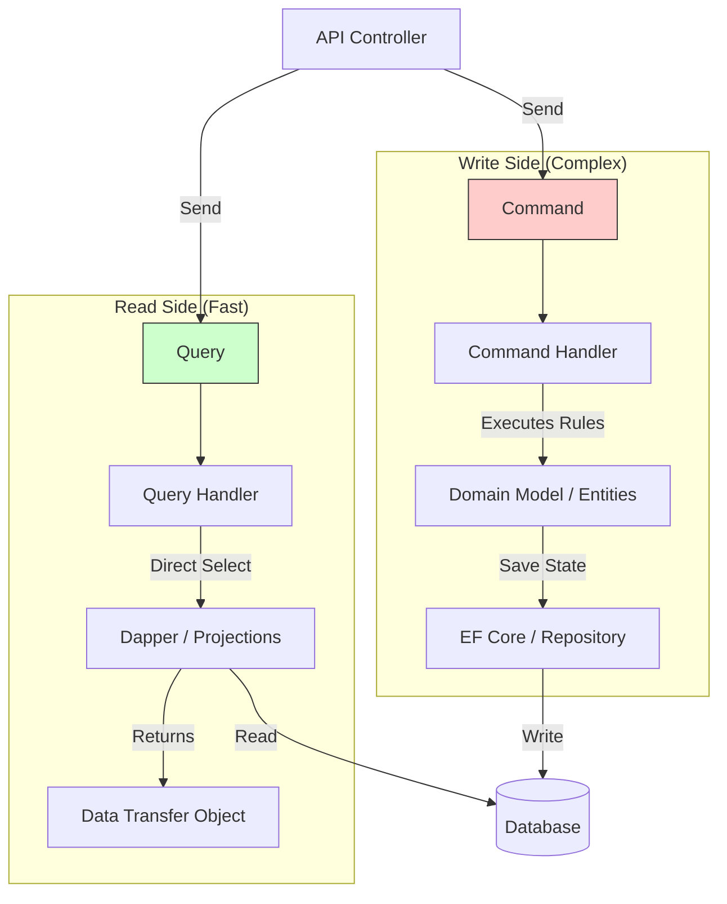

---
aliases:
tags:
  - architecture
  - DesignPatterns
  - dotnet
date: 2026-03-02 16:32
status:
---
# CQRS (Command Query Responsibility Segregation)
---

## 💡 Концепция

**CQRS** — это принцип разделения ответственности на два фундаментально разных потока:
1.  **Command (Команда/Запись):** Действие, меняющее состояние системы.
    *   *Семантика:* "Сделай это".
    *   *Возврат:* `void` или `ID` созданного ресурса. Никогда не возвращает DTO с данными.
    *   *Пример:* `PlaceOrder`, `UpdatePrice`.
2.  **Query (Запрос/Чтение):** Запрос данных без изменения состояния.
    *   *Семантика:* "Дай мне это".
    *   *Возврат:* DTO / ViewModel.
    *   *Пример:* `GetOrderById`, `SearchProducts`.

**Какую проблему решает?**
В сложных системах требования к **Записи** (валидация, бизнес-правила, транзакции) и **Чтению** (фильтрация, пагинация, агрегация) кардинально отличаются. Использование единой модели (Entity) для обоих сценариев приводит к компромиссам: либо мы перегружаем Entity лишними полями для View, либо пишем сложные JOIN-ы через ORM, убивая производительность.

---

## 🔑 Ключевое отличие: CRUD vs CQRS

| Характеристика | **CRUD (Классический)** | **CQRS** |
| :--- | :--- | :--- |
| **Модель данных** | Единая (Entity используется и для логики, и для UI). | Раздельная (Write Model для логики, Read Model для UI). |
| **Оптимизация** | Компромиссная (база должна уметь все). | Точечная (Write Stack оптимизирован на запись, Read Stack — на чтение). |
| **Безопасность** | DTO часто дублируют Entity, есть риск оверпостинга. | Четкое разделение намерений (Intent). |
| **Сложность** | Низкая (1 класс Service). | Высокая (2 класса: CommandHandler + QueryHandler). |

> [!INFO] Заблуждение
> CQRS **не обязывает** иметь две разные базы данных (например, SQL для записи и Mongo для чтения). Это *возможная* опция (Physical CQRS), но чаще всего начинают с разделения на уровне кода (Logical CQRS) с одной БД.

---

##  Структура решения (.NET)

В экосистеме .NET стандарт де-факто — библиотека **[[MediatR]]**. CQRS обычно реализуется внутри слоя **Application** в [[Clean Architecture]].

```text
MyProject.Application
├── Common
│   ├── Behaviors           (Validation, Logging Pipelines)
│   └── Interfaces
├── Features
│   └── Products            (Vertical Slice по фичам)
│       ├── Commands
│       │   ├── CreateProduct
│       │   │   ├── CreateProductCommand.cs  (IRequest<int>)
│       │   │   ├── CreateProductHandler.cs  (Логика записи)
│       │   │   └── CreateProductValidator.cs
│       │   └── DeleteProduct
│       └── Queries
│           ├── GetProductById
│           │   ├── GetProductByIdQuery.cs   (IRequest<ProductDto>)
│           │   ├── GetProductByIdHandler.cs (Логика чтения)
│           │   └── ProductDto.cs            (Плоская модель)
│           └── GetProductList
```

**Пример кода (C#):**

```csharp
// 1. Command (Intent) - Immutable Record
public record CreateProductCommand(string Name, decimal Price) : IRequest<int>;

// 2. Handler (Business Logic)
public class CreateProductHandler : IRequestHandler<CreateProductCommand, int>
{
    private readonly IApplicationDbContext _context; // EF Core
    
    public async Task<int> Handle(CreateProductCommand request, CancellationToken ct)
    {
        var entity = new Product(request.Name, request.Price); // Domain logic
        _context.Products.Add(entity);
        await _context.SaveChangesAsync(ct);
        return entity.Id;
    }
}

// 3. Query (Request)
public record GetProductByIdQuery(int Id) : IRequest<ProductDto>;

// 4. Query Handler (Optimization: Dapper instead of EF)
public class GetProductHandler : IRequestHandler<GetProductByIdQuery, ProductDto>
{
    private readonly IDbConnection _db; // Dapper Connection
    
    public async Task<ProductDto> Handle(GetProductByIdQuery request, CancellationToken ct)
    {
        // Читаем напрямую, минуя Domain Logic
        return await _db.QueryFirstOrDefaultAsync<ProductDto>(
            "SELECT Name, Price FROM Products WHERE Id = @Id", new { request.Id });
    }
}
```

---

## Диаграмма потоков (Logical CQRS)

Обрати внимание: **Write Side** идет через сложный Domain Model, а **Read Side** срезает углы и читает данные максимально быстро (Fast Track).



---

## Плюсы и Минусы (Trade-offs)

### ✅ Плюсы
1.  **Масштабируемость чтения:** Поскольку модели разделены, мы можем кэшировать Queries (Redis) или использовать реплики БД (Read Replicas), не влияя на логику записи.
2.  **Упрощение сложных доменов:** В модели записи (`Domain`) нет лишних полей, нужных только для UI (например, `FormattedDate` или `UserName` вместо `UserId`).
3.  **Гибкость рефакторинга:** Можно переписать SQL-запрос для отчета, не боясь сломать бизнес-правило создания заказа.

### ❌ Минусы
1.  **Взрывное количество классов:** На каждое действие (Get, Create, Update) нужен отдельный файл команды/запроса, хендлер, валидатор. `ProductService` на 5 методов превращается в 15 файлов.
2.  **Снижение связности (Cohesion):** Логика работы с продуктом размазана по разным папкам (Features). Сложно увидеть "всю картину" в одном месте.
3.  **Eventual Consistency (при разных БД):** Если вы используете отдельную базу для чтения (например, ElasticSearch), данные там появятся с задержкой. Пользователь создал товар, обновил список, а товара еще нет. Это сложно объяснять бизнесу.

> [!WARNING] Золотое правило
> Не применяйте CQRS для всего проекта сразу (Whole System CQRS). Применяйте его только в ограниченных контекстах (Bounded Contexts), где высока сложность логики или нагрузка. Для справочников "Типы документов" CQRS избыточен.

---

## 🔗 Связь с другими паттернами

*   **[[Clean Architecture]]:** CQRS идеально ложится в слой **Application**. Use Cases превращаются в Handlers.
*   **[[Event Sourcing]]:** Часто идут в паре. При Event Sourcing сохраняются только события (Write), а для чтения (Query) эти события проецируются в плоские таблицы (Read Models).
*   **[[Microservices Architecture]]:** CQRS помогает внутри микросервиса разделить нагрузку. Также паттерн "Transaction Script" часто используется в Query-части.

---

## Практический кейс: Эволюция поиска товаров

**Проект:** E-commerce платформа "ShopNet".

### 1. Старт (Monolith N-Layer)
У нас есть `ProductService`. Метод `GetProducts(filter)` возвращает `List<ProductEntity>`.
*Проблема:* Фильтры усложняются (цвет, размер, цена, наличие). EF Core генерирует чудовищный SQL. Пользователи ждут 5 секунд.

### 2. Рефакторинг (Clean Architecture)
Выделили `IProductRepository`. Логика стала чище, но SQL все еще генерируется ORM. Сущность `Product` перегружена навигационными свойствами (`Reviews`, `Variants`), которые тянутся `Include`-ами.

### 3. Оптимизация (CQRS - Logical)
Мы внедряем **CQRS** только для модуля "Каталог".
*   **Command:** `UpdateProductPriceCommand` — использует EF Core, загружает Агрегат, проверяет бизнес-правила (маржинальность), сохраняет.
*   **Query:** `SearchProductsQuery` — написан на **Dapper**. Пишем сырой SQL запрос. Выбираем только нужные 5 полей для карточки товара.
*   *Результат:* Скорость поиска выросла в 10 раз. Запись осталась надежной.

### 4. Масштабирование (CQRS - Physical / Polyglot Persistence)
Нагрузка на поиск выросла до 10k RPS (Black Friday). SQL Server не справляется с `LIKE %text%` поиском.
*   **Решение:** Внедряем **ElasticSearch** как Read Database.
*   **Sync:** При успешном выполнении `CreateProductCommand`, мы кидаем событие `ProductCreated`. Background Worker ловит его и обновляет индекс в Elastic.
*   **Query:** `SearchProductsQueryHandler` теперь идет не в SQL, а в ElasticSearch.
*   *Результат:* Мгновенный полнотекстовый поиск. Задержка обновления (Eventual Consistency) ~1 сек, что допустимо для поиска.


**Связи:** [[Clean Architecture]], [[Mediator Pattern]], [[Event Sourcing]], [[CAP Theorem]], [[MediatR]]