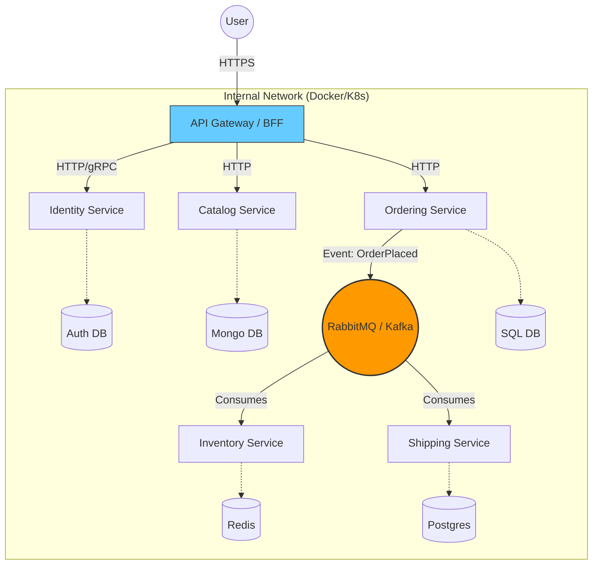

---
aliases:
  - микросервисной архитектуры
tags:
  - architecture
  - DesignPatterns
  - dotnet
date: 2026-03-02 16:46
status:
---
## Концепция

**Microservices** — это архитектурный стиль, при котором единое приложение строится как набор небольших сервисов, каждый из которых:
1.  Запускается в собственном процессе.
2.  Имеет **собственную базу данных** (Shared Database Anti-Pattern).
3.  Коммуницирует через легковесные механизмы (HTTP API или Messaging).
4.  Строится вокруг **Бизнес-контекста** (Bounded Context из [[DDD (Domain-Driven Design)]]).

**Какую проблему решает?**
Главная проблема, которую решают микросервисы — это **Масштабирование разработки (Team Scaling)**, а не производительности.
Когда над монолитом работают 100 человек, они блокируют друг друга при мержах, деплоях и тестировании. Микросервисы позволяют 10 командам по 10 человек работать независимо, деплоить свои части системы хоть 50 раз в день, не боясь уронить весь магазин.

---

## Ключевое отличие: Module vs Service

Многие путают "Модульный Монолит" и "Микросервисы".

| Характеристика | **Module (Модуль)** | **Microservice (Микросервис)** |
| :--- | :--- | :--- |
| **Граница** | Логическая (Logical Boundary). | Физическая (Physical Boundary). |
| **Коммуникация** | Вызов метода в памяти (In-Process). | Сетевой вызов (RPC/REST/AMQP). |
| **Отказ** | Ошибка в модуле может положить весь процесс. | Падение сервиса изолировано (Circuit Breaker). |
| **Деплой** | Весь монолит целиком. | Независимый (Independent Deployment). |
| **Данные** | Общие таблицы, Foreign Keys работают. | Своя БД. FK и JOIN между сервисами **невозможны**. |

---

## Структура решения (.NET)

В мире микросервисов нет одного `.sln`. Обычно это **Polyrepo** (один репозиторий — один сервис). Но для старта часто используют **Monorepo** структуру.

```text
MyMicroservices.sln (или папка с репозиториями)
├── BuildingBlocks           (Shared Kernel / NuGet Libraries)
│   ├── EventBus.RabbitMQ       (Абстракция шины сообщений)
│   └── Common.Logging          (Serilog setups)
│
├── Services
│   ├── Identity             (Auth Service)
│   │   ├── Identity.API        (ASP.NET Core, IdentityServer/Duende)
│   │   └── Identity.Data       (SQL Server DB)
│   │
│   ├── Catalog              (Read-heavy service)
│   │   ├── Catalog.API         (MongoDB for fast read)
│   │   └── Catalog.Core
│   │
│   └── Ordering             (Write-heavy complex logic)
│       ├── Ordering.API        (DDD, SQL Server)
│       ├── Ordering.Domain     (Rich Model)
│       └── Ordering.BackgroundTasks (Worker для обработки событий)
│
└── Gateways
    └── Web.BFF                 (YARP / Ocelot - единая точка входа)
```

**Пример коммуникации (C# + MassTransit):**

```csharp
// 1. Order Service (Publisher)
public async Task CreateOrder(Order order) {
    _dbContext.Orders.Add(order);
    await _dbContext.SaveChangesAsync();
    
    // Публикуем событие "Факт": Заказ создан. 
    // Нам все равно, кто его слушает.
    await _publishEndpoint.Publish(new OrderCreatedEvent(order.Id, order.UserId));
}

// 2. Inventory Service (Consumer)
// Реагирует асинхронно. Если сервис лежит, сообщение подождет в очереди RabbitMQ.
public class OrderCreatedConsumer : IConsumer<OrderCreatedEvent> {
    public async Task Consume(ConsumeContext<OrderCreatedEvent> context) {
        var orderId = context.Message.OrderId;
        await _inventoryRepository.ReserveStockAsync(orderId);
    }
}
```

---

## Диаграмма архитектуры

Здесь важно показать **API Gateway** (входная дверь) и **Event Bus** (нервная система).



---

## Плюсы и Минусы
### ✅ Плюсы
1.  **Agility & Deployment:** Можно обновить сервис "Скидки" в черную пятницу, не пересобирая и не рискуя сервисом "Оплата".
2.  **Технологическая свобода:** Сервис ML рекомендаций можно писать на Python, высоконагруженный шлюз на Go, а бизнес-логику на C# .NET 8.
3.  **Изоляция сбоев:** Утечка памяти в генераторе PDF-отчетов "убьет" только этот сервис, основной сайт продолжит работать.

### ❌ Минусы
1.  **Распределенные транзакции:** Их нет. `TransactionScope` не работает. Нужно реализовывать паттерн [[Saga Pattern]] (Rollback вручную через компенсирующие транзакции). Это *очень* сложно.
2.  **Сложность эксплуатации (Ops):** Вам нужен Kubernetes, ELK Stack (логи), Prometheus/Grafana (метрики), Jaeger (трейсинг). Без DevOps инженера проект умрет.
3.  **Network Latency:** В монолите вызов — 0ms. В микросервисах цепочка из 5 вызовов — это 500ms+.
4.  **Consistency:** Данные не согласованы мгновенно. В "Складе" товар списан, а в "Каталоге" он еще виден. Это **Eventual Consistency**.

> [!CAUTION] Золотое правило "Monolith First"
> Мартин Фаулер: "Не начинайте новый проект с микросервисов".
> Начните с **Modular Monolith**. Если границы модулей выбраны неверно в монолите, рефакторинг займет 1 час. В микросервисах — 1 месяц. Распиливайте монолит только тогда, когда он стал проблемой.

---

## Связь с другими паттернами

*   **[[Clean Architecture]]:** Используется **внутри** каждого конкретного микросервиса для организации кода.
*   **[[CQRS]]:** Часто применяется на уровне всей системы (один сервис обновляет данные, другой готовит витрины данных для чтения).
*   **[[BFF (Backend for Frontend)]]:** Паттерн [[API Gateway]], адаптирующий ответы микросервисов под конкретный клиент (Mobile vs Web).

---

## 🛒 Практический кейс: Эволюция ShopNet

Финальный этап развития нашего E-commerce проекта.

### 1. Ситуация (Monolith Clean Arch + CQRS)
Проект успешен. 50 разработчиков. Код разделен на модули `Catalog`, `Orders`, `Shipping` внутри одного `.sln`. Используется Clean Architecture. CQRS оптимизирует поиск.
**Проблема:**
Команда логистики хочет внедрить сложный алгоритм расчета маршрутов на Python. Команда каталога хочет перейти на NoSQL (MongoDB). Все они работают в одном репо, билды идут по 40 минут. Любой деплой требует остановки всего магазина.

### 2. Масштабирование (Extraction)
Мы решаем вынести модуль **Shipping (Доставка)** в микросервис.

**Шаги миграции (Strangler Fig Pattern):**
1.  **Создание:** Создаем новый репозиторий `ShopNet.Shipping`. Копируем туда Clean Architecture код из монолита (Domain + Application).
2.  **База данных:** Создаем отдельную PostgreSQL базу для доставки. Мигрируем данные таблиц `Shipments` из общей БД. Удаляем FK связи в старой БД!
3.  **Интеграция:**
    *   В монолите (теперь он Legacy Core) вместо прямого вызова `ShippingService.CreateLabel()` ставим публикацию события в RabbitMQ: `bus.Publish(new OrderPaidEvent(...))`.
    *   В новом микросервисе подписываемся на это событие и создаем накладную.
4.  **Gateway:** Настраиваем API Gateway (YARP), чтобы запросы `/api/shipping/*` летели сразу в новый сервис, минуя монолит.

### 3. Результат
*   Команда доставки пишет на чем хочет.
*   Если сервис доставки упадет, заказы все равно принимаются (просто накладные создадутся, когда он поднимется).
*   Билд монолита стал быстрее.

**Итог:** Архитектура стала сложнее (появился RabbitMQ, Docker), но организационно мы развязали руки командам.

**Связи:** [[Distributed Systems]], [[Event-Driven Architecture]], [[CAP Theorem]], [[API Gateway]], [[Docker]], [[Kubernetes]]