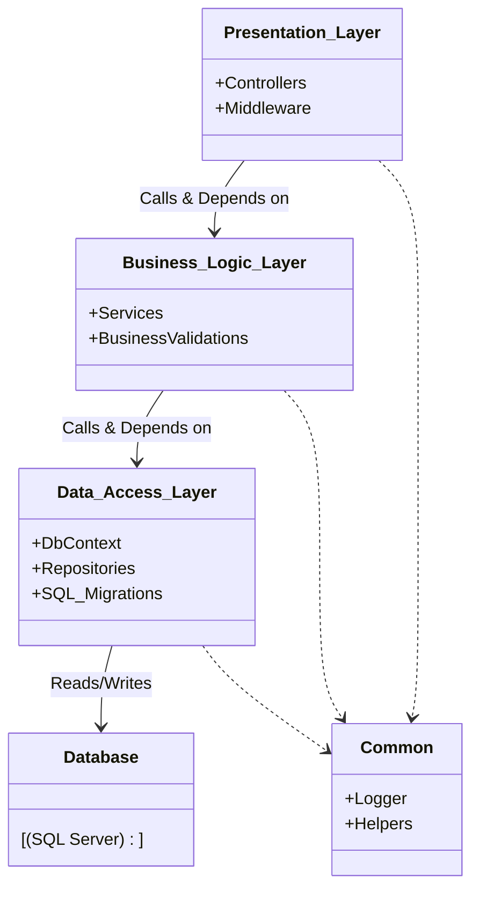

---
aliases:
tags:
  - architecture
  - dotnet
  - DesignPatterns
date: 2026-03-02 15:09
status:
---
#### **Тип:** Монолитная архитектура (логическое разделение)
---

## Концепция
**N-Layer Architecture** (Слоистая архитектура) — это способ организации кода, при котором функциональность разбивается на горизонтальные слои (Layers). Каждый слой имеет свою зону ответственности.

**Главное правило:** Зависимости всегда направлены **сверху вниз**.
*   Слой `Presentation` знает о `Business Logic`.
*   Слой `Business Logic` знает о `Data Access`.
*   Слой `Data Access` знает только о Базе Данных.
*   Нижние слои **ничего не знают** о верхних.

### Какую проблему решает?
1.  **Spaghetti Code:** Предотвращает смешивание SQL-запросов, валидации и HTML-разметки в одном файле.
2.  **Reusability:** Логику (BLL) можно переиспользовать в разных UI (например, WebAPI и Console App).
3.  **Separation of Concerns:** Разработчик БД может менять оптимизацию запросов в DAL, не ломая верстку в Presentation.

---

## Ключевое отличие: Layer vs Tier

Эту разницу спрашивают на собеседованиях 9 из 10 раз.

| Понятие | Перевод | Суть | Пример |
| :--- | :--- | :--- | :--- |
| **Layer (Слой)** | Логический слой | Организация **кода**. Разделение на проекты (`.csproj`), пространства имен (`namespace`) или папки внутри одного приложения. | Папки `Controllers`, `Services`, `Repositories` в одном решении. |
| **Tier (Звено)** | Физический уровень | Организация **инфраструктуры**. Физическое разделение на разные серверы или процессы. | Web Server (IIS), App Server, Database Server. |

> [!NOTE] Архитектурный нюанс
> N-Layer приложение (код) может быть развернуто на 1 Tier (все на одном сервере) или на 3 Tiers (веб-сервер, сервер приложений, сервер БД). **Layer — про код, Tier — про железо/сеть.**

---

## 🏗️ Структура решения (.NET)

Классический подход "Three-Layer Architecture" в Visual Studio.

```text
MyShop.sln
├── 1. Presentation Layer
│   └── MyShop.WebAPI           (ASP.NET Core Project)
│       ├── Controllers         (Принимают HTTP, зовут BLL)
│       └── ViewModels/DTOs     (Модели для клиента)
│
├── 2. Business Logic Layer (BLL)
│   └── MyShop.Business         (Class Library)
│       ├── Services            (Классы: OrderService, ProductService)
│       ├── Interfaces          (IOrderService)
│       └── DomainModels        (Бизнес-модели, валидация)
│
├── 3. Data Access Layer (DAL)
│   └── MyShop.Data             (Class Library)
│       ├── Context             (EF Core DbContext)
│       ├── Entities            (Таблицы БД: OrderEntity, ProductEntity)
│       └── Repositories        (Реализация доступа к данным)
│
└── 4. Common / Cross-Cutting   (Optional)
    └── MyShop.Common           (Логирование, Утилиты, Хелперы)
```

---

## 📊 Диаграмма зависимостей

Обрати внимание на стрелки. В N-Layer зависимость "жесткая": BLL зависит от DAL. Это главное отличие от [[Clean Architecture]], где эта зависимость инвертируется.



---

## Плюсы и Минусы (Trade-offs)

### ✅ Плюсы
1.  **Низкий порог входа:** Это стандартная архитектура, которую понимают все Junior/Middle разработчики.
2.  **Скорость разработки:** Меньше "церемоний" (интерфейсов, мапперов), чем в Clean Architecture. Отлично для MVP.
3.  **Инструментарий:** Visual Studio отлично поддерживает скаффолдинг для такой структуры.

### ❌ Минусы
1.  **Транзитивная зависимость:** Поскольку BLL зависит от DAL, любое изменение в базе данных (DAL) может потребовать перекомпиляции и изменения бизнес-логики (BLL), а затем и UI.
2.  **Сложность тестирования:** Трудно протестировать BLL изолированно. Если BLL жестко инстанцирует DAL, вам нужна живая база для тестов. (Решается через [[Dependency Injection]], но архитектура сама по себе провоцирует высокую связность).
3.  **Database Driven Design:** Разработчики склонны сначала проектировать таблицы БД, а потом "натягивать" на них классы. Это ведет к **[[Anemic Domain Model]]** (анемичной модели), где объекты — это просто мешки с данными без поведения.

> [!WARNING] Когда НЕ использовать
> Не используйте N-Layer для сложных систем с долгой жизнью (5+ лет) и сложной бизнес-логикой. Со временем BLL превратится в "Service Layer", где методы будут по 2000 строк кода. Для сложных проектов берите [[Clean Architecture]].

---

## Связь с другими паттернами

*   **[[Clean Architecture]]:** N-Layer эволюционирует в Clean. Главный шаг — применить **Dependency Inversion Principle (DIP)** к связи между BLL и DAL, чтобы BLL перестал зависеть от БД.
*   **[[Microservices]]:** Микросервис *внутри себя* часто построен по принципу N-Layer (так как он маленький и сложная архитектура там может быть избыточной).
*   **[[CQRS]]:** В классическом N-Layer внедрить CQRS сложно, так как модели чтения и записи обычно одни и те же (Entities).

---

## Практический кейс: Эволюция E-commerce

Представим проект **ShopNet** (интернет-магазин запчастей).

### Этап 1: Старт (Monolith N-Layer)

**Задача:** Быстро запустить продажу товаров.
**Реализация:**
Мы создали 3 проекта.
В слое **DAL** есть EF Core сущность:
```csharp
public class ProductEntity { 
    public int Id { get; set; } 
    public string Name { get; set; } 
    public decimal Price { get; set; }
}
```

В слое **BLL** есть сервис, который просто проксирует запрос:
```csharp
// BLL зависит от DAL
public class ProductService {
    private readonly ProductRepository _repo;
    public ProductService(ProductRepository repo) => _repo = repo;

    public ProductEntity GetById(int id) {
        // Логика может быть тут: проверка доступности
        return _repo.Find(id); 
    }
}
```

**Проблема роста:**
Бизнес просит: "При расчете цены нужно учитывать скидку пользователя, сезон, курс валют и наличие на складе партнера".
Код в `ProductService` разрастается. Мы начинаем добавлять туда вызовы `UserRepository`, `CurrencyRepository`. Сервис превращается в "God Object".
Изменение поля в БД (например, переименование `Price` в `BasePrice`) ломает сервис.

**Решение:** Переход к этапу 2 -> **[[Clean Architecture]]**, чтобы изолировать бизнес-правила (расчет цены) от деталей базы данных.