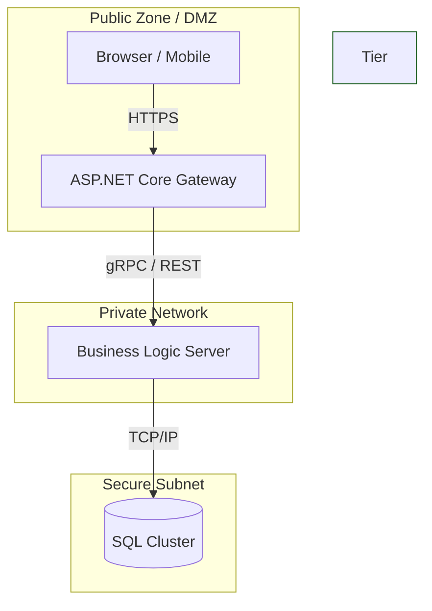

---
aliases:
tags:
  - architecture
  - DesignPatterns
  - dotnet
date: 2026-03-02 15:50
status:
---
# **Тип:** Физическая / Распределенная архитектура
---

## 💡 Концепция

**N-Tier Architecture** (Многозвенная архитектура) — это архитектурный стиль, при котором функциональные слои приложения физически разделены и работают на разных вычислительных узлах (серверах, контейнерах, виртуальных машинах).

Каждое "звено" (Tier) — это отдельный процесс или компьютер, общающийся с другими через сеть.

**Какую проблему решает?**
1.  **Безопасность (Security):** База данных и бизнес-логика прячутся во внутреннюю сеть (Intranet/VPN), недоступную из публичного интернета. В DMZ (демилитаризованной зоне) остается только легкий Web-сервер.
2.  **Независимое масштабирование (Scalability):** Если "тормозит" база, мы добавляем ресурсы серверу БД. Если много пользователей на сайте — добавляем Web-серверы, не трогая сервер приложений.
3.  **Отказоустойчивость:** Падение Web-сервера не убивает бизнес-процессы, выполняющиеся на App-сервере.

---

## Ключевое отличие: Layer vs Tier

Это фундаментальное различие, которое обязан знать Senior Architect.

| Характеристика | **N-Layer (Слои)** | **N-Tier (Звенья)** |
| :--- | :--- | :--- |
| **Суть** | Логическая организация кода. | Физическое размещение компонентов. |
| **Где находится** | Внутри Solution Explorer (папки, проекты). | В инфраструктуре (Azure, AWS, On-Premise серверах). |
| **Коммуникация** | Вызов методов в памяти (In-Process Call). Быстро (наносекунды). | Сетевые вызовы (HTTP, TCP, gRPC). Медленно (миллисекунды). |
| **Пример** | `Controller` вызывает `Service` через DI. | `Web Server` вызывает `App Server` по REST API. |

> [!WARNING] Золотое правило
> Вы можете иметь **3-Layer** приложение (код разделен на UI, BLL, DAL), развернутое как **1-Tier** (все на одном IIS сервере).
> Но вы не можете создать **3-Tier** архитектуру, если ваш код не разделен минимум на 3 слоя.

---

## 🏗️ Структура решения (.NET)

Для N-Tier архитектуры недостаточно просто разделить классы. Вам нужны **разные запускаемые проекты** (Entry Points), которые будут деплоиться на разные машины.

Типичный Solution для 3-Tier приложения:

```text
MyEnterpriseApp.sln
├── 1. Presentation Tier (Deployed to Public Web Server)
│   └── MyEnterpriseApp.WebGateway  (ASP.NET Core WebAPI - "BFF")
│       └── Controllers             (Принимают JSON от Frontend, зовут App Tier)
│
├── 2. Application Tier (Deployed to Internal App Server)
│   └── MyEnterpriseApp.CoreService (ASP.NET Core / gRPC Service)
│       ├── Services                (Реальная бизнес-логика)
│       └── Domain                  (Правила)
│
├── 3. Shared Contracts
│   └── MyEnterpriseApp.Contracts   (DTOs, Interfaces - общие для Web и Core)
│
└── 4. Data Access (Inside App Tier)
    └── MyEnterpriseApp.Data        (EF Core, доступ к SQL Server)
```

**Пример кода (Communication):**
Слой Presentation больше не вызывает сервис напрямую. Он делает HTTP запрос.

```csharp
// Presentation Tier (Web Gateway)
public class OrderController : ControllerBase
{
    private readonly HttpClient _httpClient; // Или gRPC Client

    public async Task<IActionResult> CreateOrder(OrderDto dto)
    {
        // Сетевой вызов во внутренний контур
        var response = await _httpClient.PostAsJsonAsync("https://internal-app-server/api/orders", dto);
        return StatusCode((int)response.StatusCode);
    }
}
```

---

## 📊 Диаграмма развертывания

Диаграмма показывает классическую **3-Tier** архитектуру.



---

## ⚖️ Плюсы и Минусы (Trade-offs)

### ✅ Плюсы
1.  **Enhanced Security:** Даже если хакер взломает Web-сервер (Tier 1), он не получит прямого доступа к базе данных, так как она закрыта фаерволом и доступна только с App-сервера (Tier 2).
2.  **Технологическая независимость:** Web-tier может быть на Node.js, а App-tier на .NET 8.
3.  **Performance Tuning:** Можно выделить мощный сервер с большим RAM только для App-tier (кэширование, расчеты), и дешевые инстансы для Web-tier.

### ❌ Минусы
1.  **Latency (Задержка):** Самый большой враг. Вызов метода внутри процесса — это наносекунды. Вызов по сети — это 20-100 мс. Многозвенные приложения всегда медленнее монолитов.
2.  **Стоимость инфраструктуры:** Нужно минимум 2-3 сервера (или кластера) вместо одного.
3.  **Сложность отладки:** Ошибка может быть на Web-сервере, на App-сервере или в сети между ними. Нужен [[Distributed Tracing]] (например, Jaeger или OpenTelemetry).

> [!CAUTION] Ошибка новичка
> Не делайте N-Tier, если у вас 500 пользователей и нет жестких требований безопасности от службы ИБ. Вы получите тормозящее приложение, которое дорого хостить.

---

## 🔗 Связь с другими паттернами

*   **[[Microservices]]:** Микросервисы — это экстремальная версия N-Tier. Если в N-Tier мы делим серверы по *техническому* назначению (Web, App, DB), то в микросервисах — по *бизнес-доменам* (Order Service, Catalog Service).
*   **[[Clean Architecture]]:** Часто используется **внутри** Application Tier (Tier 2), чтобы организовать сложную бизнес-логику.
*   **[[BFF (Backend for Frontend)]]:** Presentation Tier часто выполняет роль BFF — агрегирует данные и отдает их на фронтенд.

---

## 🛒 Практический кейс: Эволюция E-commerce

Вернемся к **ShopNet**.

### Этап 1: N-Layer (Logical) на 1 сервере
У нас есть проекты `WebAPI`, `BLL`, `DAL`. Все скомпилировано в одну DLL и крутится в Azure App Service. База данных рядом.
*Проблема:* Служба безопасности банка-партнера запрещает хранить данные кредиток на сервере, который "торчит" в интернет.

### Этап 2: Переход на N-Tier (Physical Separation)
**Рефакторинг:**
1.  Выделяем новый проект `ShopNet.InternalApi`. Переносим туда `BLL` и `DAL`.
2.  Старый `WebAPI` чистим, оставляя только контроллеры. Теперь он — просто шлюз.
3.  **Деплой:**
    *   `WebAPI` -> DMZ (доступен из мира).
    *   `InternalApi` -> Внутренняя сеть (доступ только с WebAPI).
    *   `Database` -> Закрытая сеть.

**Результат:** Безопасность соблюдена. Данные изолированы.

### Этап 3: Проблема производительности
Пользователи жалуются, что сайт стал работать медленнее.
*Причина:* Каждый клик теперь требует прохода через HTTP запрос между серверами.
*Оптимизация:* Внедрение **gRPC** вместо REST JSON для общения между Tier 1 и Tier 2 (бинарный протокол быстрее).

### Этап 4: Подготовка к микросервисам
Когда `InternalApi` (Tier 2) становится слишком большим, мы начинаем "отпиливать" от него куски и выносить их на отдельные серверы. Так N-Tier плавно превращается в распределенную систему микросервисов.