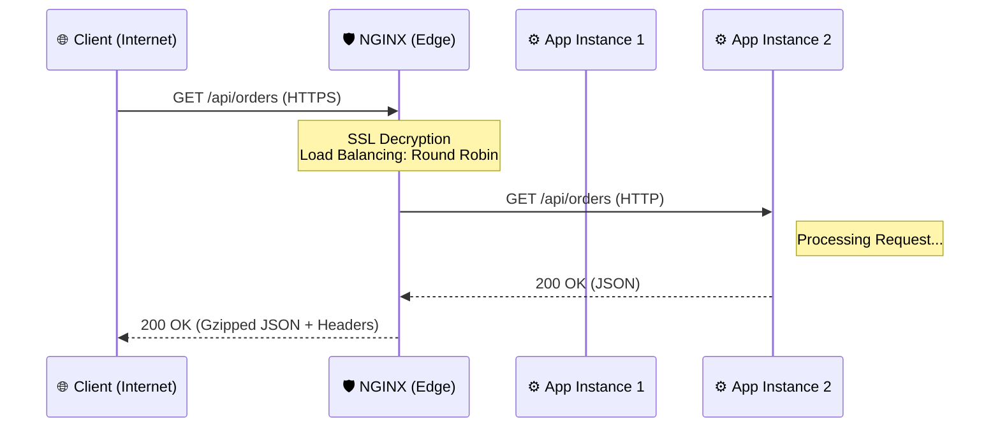

---
aliases:
tags:
  - architecture
  - infrastructure
date: 2026-03-02 19:37
status:
---
> [!info] Определение
> **NGINX** (произносится как "Engine-X") — это высокопроизводительный [[HTTP]]-сервер, обратный прокси-сервер (Reverse [[Proxy]]) и почтовый прокси-сервер. В отличие от традиционных серверов (как Apache), он использует асинхронную событийно-ориентированную архитектуру.

### Философия и задачи
Главная задача NGINX — эффективная обработка огромного количества одновременных соединений (**проблема C10k**). Он выступает "умной прослойкой" между интернетом и вашим приложением, обеспечивая безопасность, масштабируемость и скорость.

---

### Ключевые принципы и возможности

1. **Event-driven (Событийная модель)**: Не создает новый поток (thread) для каждого запроса, а обрабатывает тысячи запросов в одном потоке с помощью неблокирующего ввода-вывода.
2. **Master-Worker Process**: Один Master-процесс управляет конфигурацией, а несколько Worker-процессов обрабатывают запросы.
3. **[[Reverse Proxy]] (Обратный прокси)**: Принимает запросы клиентов и перенаправляет их на внутренние сервера (Upstreams).
4. **[[Load Balancing]] (Балансировка нагрузки)**: Распределяет трафик между несколькими экземплярами приложения (Round-robin, Least-conn, IP-hash).
5. **SSL Termination**: Берет на себя тяжелую работу по расшифровке [[SSL]]/[[TLS]] трафика, передавая приложению чистый [[HTTP]].
6. **Статика**: Молниеносно отдает статические файлы (HTML, CSS, JS, изображения) напрямую с диска, не беспокоя backend.

---

### Практическая реализация (Конфигурация)

Конфигурация строится на вложенных блоках: `http` -> `server` -> `location`.

#### Типовой пример конфигурации:
```nginx
http {
    # Список серверов приложения (Upstream)
    upstream my_dotnet_app {
        server 127.0.0.1:5000;
        server 127.0.0.1:5001;
    }

    server {
        listen 80;
        server_name example.com;

        # Отдача статики
        location /static/ {
            root /var/www/data;
        }

        # Проксирование запросов к API
        location /api/ {
            proxy_pass http://my_dotnet_app;
            proxy_set_header Host $host;
            proxy_set_header X-Real-IP $remote_addr;
        }
    }
}
```

#### Таблица важных директив:
| Директива | Описание |
| :--- | :--- |
| `proxy_pass` | Указывает адрес внутреннего сервера, куда слать запрос. |
| `worker_processes` | Количество рабочих процессов (обычно равно числу ядер CPU). |
| `keepalive_timeout` | Время удержания соединения с клиентом открытым. |
| `try_files` | Проверяет наличие файлов по указанному пути перед проксированием. |

---

### Диаграмма взаимодействия



---

### Интеграция

В экосистеме .NET NGINX обычно ставится перед сервером [[Kestrel]]. Это называется **Edge Server configuration**.

**Важно:** Чтобы .NET приложение правильно понимало [[IP-адрес]] клиента и протокол ([[HTTPS]]), нужно настроить `ForwardedHeaders`.

#### 1. Настройка в Startup.cs / Program.cs:
```csharp
using Microsoft.AspNetCore.HttpOverrides;

var builder = WebApplication.CreateBuilder(args);
var app = builder.Build();

// Настройка для работы за прокси (NGINX)
app.UseForwardedHeaders(new ForwardedHeadersOptions
{
    ForwardedHeaders = ForwardedHeaders.XForwardedFor | ForwardedHeaders.XForwardedProto
});

app.MapGet("/", () => "Hello from behind NGINX!");
app.Run();
```

#### 2. Настройка в NGINX для .NET:
```nginx
location / {
    proxy_pass         http://localhost:5000;
    proxy_http_version 1.1;
    proxy_set_header   Upgrade $http_upgrade;
    proxy_set_header   Connection keep-alive;
    proxy_set_header   Host $host;
    proxy_cache_bypass $http_upgrade;
    proxy_set_header   X-Forwarded-For $proxy_add_x_forwarded_for;
    proxy_set_header   X-Forwarded-Proto $scheme;
}
```

---

### Best Practices & Anti-patterns

#### ✅ Do (Как надо)
- **Gzip Compression**: Включайте сжатие для уменьшения объема передаваемых данных.
- **Micro-caching**: Кэшируйте GET-запросы на 1-2 секунды для защиты от всплесков трафика.
- **Health Checks**: Настраивайте проверку доступности upstream-серверов.
- **Security Headers**: Добавляйте заголовки `X-Frame-Options`, `X-Content-Type-Options`.

#### ❌ Don't (Как не надо)
- > [!warning] Root как пользователь
    > Никогда не запускайте Worker-процессы от имени `root`. Используйте пользователя `www-data` или `nginx`.
- > [!danger] Тяжелый конфиг
    > Не пишите всё в одном файле `nginx.conf`. Используйте директиву `include /etc/nginx/conf.d/*.conf;`.
- **Игнорирование логов**: Не забывайте настраивать ротацию логов, иначе они быстро забьют диск.