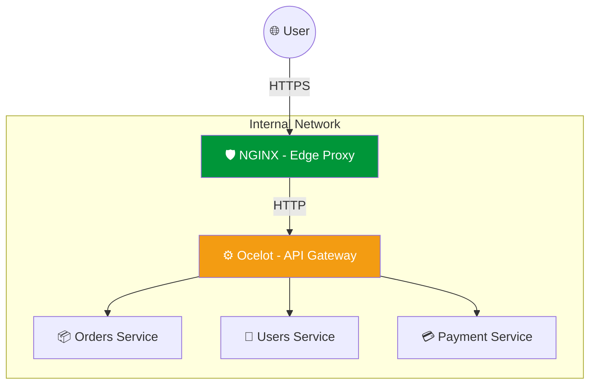

---
aliases:
tags:
  - infrastructure
  - dotnet
  - architecture
date: 2026-03-02 20:18
status:
---
Это важное сравнение, так как в современной архитектуре эти инструменты часто используются **вместе**, а не вместо друг друга. Один работает на уровне инфраструктуры, другой — на уровне приложения.

---

# Сравнение: NGINX vs Ocelot

> [!abstract] Краткий итог
> **NGINX** — это высокопроизводительный инфраструктурный инструмент (написан на C), который лучше всего справляется с SSL, статикой и базовой балансировкой.
> **Ocelot** — это прикладной API-шлюз (написан на .NET), который глубоко интегрируется с бизнес-логикой, авторизацией и агрегацией данных в экосистеме Microsoft.

---

### 📊 Прямое сравнение

| Характеристика | NGINX | Ocelot |
| :--- | :--- | :--- |
| **Уровень (OSI)** | L4 (Транспортный) и L7 (Прикладной) | L7 (Прикладной / .NET Middleware) |
| **Язык разработки** | C (Максимальная производительность) | C# / .NET |
| **Производительность** | Экстремально высокая (миллионы соединений) | Высокая (ограничена средой .NET) |
| **Сложная логика** | Сложно (нужны модули или Lua) | Легко (через C# Middlewares) |
| **Агрегация запросов** | Нет (из коробки) | **Да** (объединение ответов от разных API) |
| **Конфигурация** | Файлы `.conf` | Файл `ocelot.json` или C# код |
| **SSL/TLS** | Идеально подходит для SSL Termination | Можно, но менее эффективно |
| **Статика (HTML/JS)** | Отдает мгновенно | Не предназначен для статики |

---

### Место в архитектуре (Tiered Approach)

В крупных системах используется **двухуровневая модель**:
1. **Edge Layer ([[NGINX]])**: Принимает трафик из интернета, обрезает SSL, фильтрует ботов.
2. **API Gateway Layer ([[Ocelot]])**: Проверяет права доступа, агрегирует данные, делает маршрутизацию к микросервисам.



---

### Когда выбирать каждый из них?

#### Выбирайте NGINX, если:
- Вам нужен **Reverse Proxy** для защиты серверов.
- Нужно отдавать **статический контент** (Frontend на React/Angular/Vue).
- Требуется максимальная скорость при минимальном потреблении RAM/CPU.
- Вы используете технологически разные бэкенды (Node.js, Go, Python, .NET).

#### Выбирайте Ocelot, если:
- Ваша команда пишет на **.NET** и хочет управлять шлюзом на C#.
- Вам нужна **Агрегация данных** (один запрос клиента -> три запроса к сервисам -> один ответ).
- Нужно глубоко интегрироваться с **IdentityServer** или другими .NET-библиотеками авторизации.
- Необходимы специфичные для микросервисов функции: [[Service_Discovery]] (Consul/Eureka) или продвинутый [[Circuit_Breaker]].

---

### Пример: Совместная работа

#### Шаг 1: NGINX (Принимает внешний трафик)
```nginx
# nginx.conf
server {
    listen 443 ssl;
    server_name api.myapp.com;

    location / {
        # Передаем всё на Ocelot
        proxy_pass http://ocelot-gateway:5000;
        proxy_set_header X-Real-IP $remote_addr;
    }
}
```

#### Шаг 2: Ocelot (Умная маршрутизация внутри)
```json
// ocelot.json
{
  "Routes": [
    {
      "DownstreamPathTemplate": "/api/v1/orders/{id}",
      "UpstreamPathTemplate": "/orders/{id}",
      "UpstreamHttpMethod": [ "Get" ],
      "LoadBalancerOptions": { "Type": "LeastConnection" },
      "AuthenticationOptions": { "AuthenticationProviderKey": "Bearer" }
    }
  ]
}
```

---

### ⚖️ Плюсы и минусы связки

> [!success] Плюсы (Do)
> - **Безопасность**: NGINX защищает от атак, Ocelot — от несанкционированного доступа к логике.
> - **Гибкость**: Легко менять бизнес-логику шлюза на C#, не трогая системные настройки NGINX.
> - **Масштабируемость**: NGINX может балансировать нагрузку между несколькими экземплярами Ocelot.

> [!warning] Минусы (Don't)
> - **Latency**: Каждый "прыжок" (Hop) через прокси добавляет несколько миллисекунд задержки.
> - **Сложность**: Нужно поддерживать два разных типа конфигурационных файлов.
> - **Overkill**: Для маленького проекта одного NGINX или встроенного в .NET [[YARP]] может быть достаточно.
