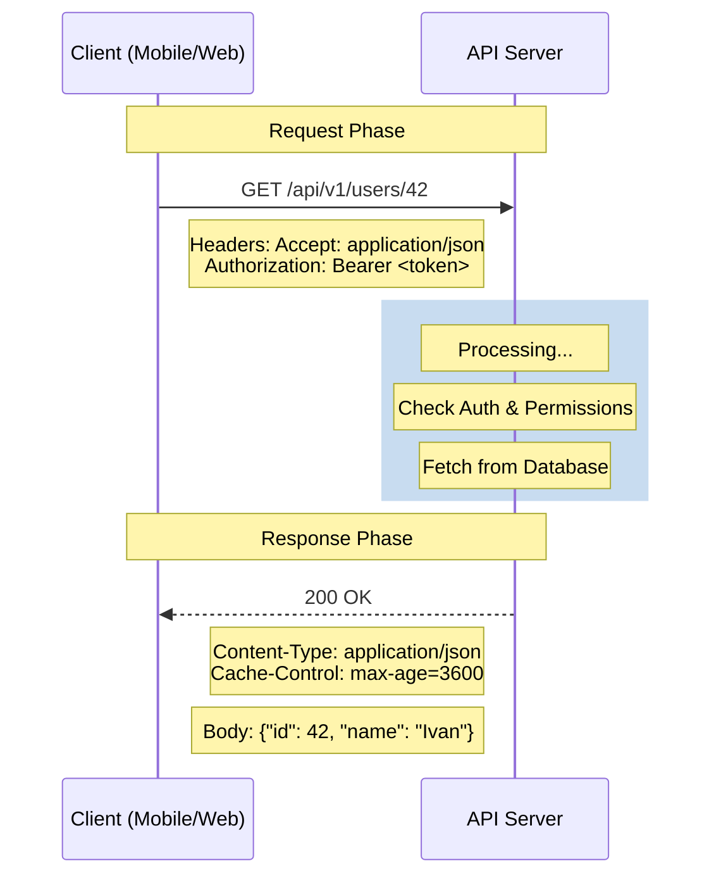

---
aliases:
tags:
  - architecture
  - DesignPatterns
  - dotnet
date: 2026-03-02 19:00
status:
---
> [!info] Определение
> **REST** — это архитектурный стиль взаимодействия компонентов распределенного приложения в сети, предложенный Роем Филдингом в 2000 году. Это не протокол, а набор ограничений, которые позволяют создавать масштабируемые, гибкие и отказоустойчивые системы.

### Философия и задачи
Главная задача REST — обеспечить **слабую связанность (loose coupling)** между клиентом и сервером. В этой парадигме всё является ресурсом, доступ к которому осуществляется по уникальному URI, а взаимодействие происходит через стандартный протокол [[HTTP]].

---

### 🧱 Ключевые ограничения (Constraints)

Для того чтобы API считалось **RESTful**, оно должно соответствовать 6 принципам:

1. **Client-Server**: Разделение ответственности. Клиент не заботится о хранении данных, сервер — о пользовательском интерфейсе.
2. **Stateless (Отсутствие состояния)**: Сервер не хранит информацию о сессии клиента. Каждый запрос должен содержать *все* данные, необходимые для его обработки.
3. **Cacheable (Кэширование)**: Ответы сервера должны явно помечаться как кэшируемые или нет, чтобы снизить нагрузку на сеть.
4. **Layered System (Многоуровневая система)**: Клиент не знает, общается он напрямую с сервером или через посредников (Proxy, Load Balancer).
5. **Uniform Interface (Единообразие интерфейса)**:
    - Идентификация ресурсов (URI).
    - Манипуляция ресурсами через представления ([[JSON]], XML).
    - "Самоописываемые" сообщения (Headers).
    - **HATEOAS** (Hypermedia as the Engine of Application State) — ответ сервера содержит ссылки на другие доступные действия.
6. **Code on Demand (опционально)**: Возможность передачи исполняемого кода от сервера клиенту (например, JavaScript-скрипты).

---

### Практическая реализация (HTTP & JSON)

В современном вебе REST почти всегда реализуется поверх [[HTTP]] с использованием [[JSON]] в качестве формата данных.

#### Таблица методов и статусов
| Метод      | Действие                  | [[Идемпотентность]] | Успешный статус         |
| :--------- | :------------------------ | :------------------ | :---------------------- |
| **GET**    | Получение ресурса         | Да                  | 200 OK                  |
| **POST**   | Создание нового ресурса   | Нет                 | 201 Created             |
| **PUT**    | Полное обновление ресурса | Да                  | 200 OK / 204 No Content |
| **PATCH**  | Частичное обновление      | Нет                 | 200 OK                  |
| **DELETE** | Удаление ресурса          | Да                  | 204 No Content          |

#### Правила именования ресурсов (URL)
- Используйте существительные во множественном числе: `/users`, а не `/getUser`.
- Используйте иерархию для связей: `/users/42/orders/10`.
- Только строчные буквы, разделение через дефис: `/audit-logs`.

---

### 📊 Диаграмма взаимодействия



---

### Уровни зрелости Ричардсона

Чтобы оценить "REST-овость" вашего сервиса, используется модель Ричардсона:
- **Level 0**: The Swamp of POX (использование HTTP как транспорта для удаленного вызова процедур, один endpoint, только POST).
- **Level 1**: Resources (у каждого ресурса свой URI, но метод один).
- **Level 2**: HTTP Verbs (использование правильных методов GET, POST, DELETE и кодов ответов).
- **Level 3**: **HATEOAS** (сервер подсказывает клиенту дальнейшие действия через ссылки).

---

### Пример 

Реализация базового контроллера, следующего принципам REST:

```csharp
[ApiController]
[Route("api/v1/[controller]")] // Версионирование через URL
public class ProductsController : ControllerBase
{
    private readonly IProductService _service;
    public ProductsController(IProductService service) => _service = service;

    [HttpGet("{id}")] // GET для получения
    public async Task<IActionResult> GetById(Guid id)
    {
        var product = await _service.GetByIdAsync(id);
        return product == null ? NotFound() : Ok(product);
    }

    [HttpPost] // POST для создания
    public async Task<IActionResult> Create([FromBody] CreateProductDto dto)
    {
        var result = await _service.CreateAsync(dto);
        // Возвращаем 201 Created со ссылкой на новый ресурс
        return CreatedAtAction(nameof(GetById), new { id = result.Id }, result);
    }

    [HttpDelete("{id}")] // DELETE для удаления
    public async Task<IActionResult> Delete(Guid id)
    {
        await _service.DeleteAsync(id);
        return NoContent(); // 204 при успешном удалении
    }
}
```

---

### Best Practices & Anti-patterns

#### ✅ 
- **Версионирование**: Всегда начинайте с `/api/v1/`.
- **Пагинация**: Для больших списков используйте `?page=1&size=10`.
- **Фильтрация**: Передавайте параметры поиска в Query String: `?status=active`.
- **Обработка ошибок**: Возвращайте понятный JSON с описанием ошибки при 4xx/5xx кодах.

❌ Don't (Как не надо)
- > [!warning] Нарушение идемпотентности
    > Использование `GET /users/delete?id=5` (GET не должен изменять состояние).
- > [!danger] Сессионный подход
    > Хранение состояния корзины в `Session` на сервере (нарушает **Stateless**).
- **Туннелирование**: Использование `200 OK` для всех ответов, даже если произошла ошибка (скрывает проблему от инфраструктуры).