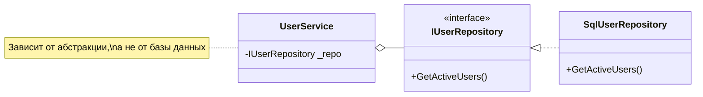

---
aliases:
  - Репозиторий
tags:
  - DesignPatterns
  - dotnet
date: 2026-03-03 16:39
status:
---
### Суть
**Проблема:** Бизнес-логика жестко привязана к базе данных ([[SQL]] или [[ORM]]). Это делает код нетестируемым и сложным для поддержки.
**Решение:** Спрятать работу с данными за интерфейсом, который имитирует простую коллекцию объектов.

> [!example] Аналогия из жизни
> **Библиотекарь**.
> Ты просишь книгу "Война и мир". Тебе всё равно, где она лежит: на столе, в хранилище или в цифровом архиве.
> Библиотекарь (Репозиторий) знает, как её достать, а ты (Сервис) просто получаешь книгу.

---

### Диаграмма классов



---

### Реализация

Пример: Работа с пользователями. Скрываем сложность EF Core.

```csharp
// 1. Абстракция (Domain Layer)
// Чистый интерфейс, никаких ссылок на EF Core или SQL
public interface IUserRepository
{
    Task<User?> GetByIdAsync(Guid id);
    Task<IEnumerable<User>> GetActiveUsersAsync(); // Готовый бизнес-запрос
    void Add(User user);
}

// 2. Реализация (Infrastructure Layer)
public class EfUserRepository(AppDbContext context) : IUserRepository
{
    public async Task<User?> GetByIdAsync(Guid id) 
        => await context.Users.FindAsync(id);

    public async Task<IEnumerable<User>> GetActiveUsersAsync()
    {
        // Инкапсулируем сложную логику фильтрации здесь
        return await context.Users
            .Where(u => u.IsActive && !u.IsDeleted)
            .ToListAsync();
    }

    public void Add(User user) => context.Users.Add(user);
}

// 3. Использование (Business Logic)
// Используем Primary Constructor для внедрения зависимости
public class UserOnboardingService(IUserRepository userRepo)
{
    public async Task ActivateUser(Guid userId)
    {
        var user = await userRepo.GetByIdAsync(userId);
        if (user is null) throw new Exception("User not found");

        user.IsActive = true;
        // Сохранение изменений обычно делает UnitOfWork, а не репозиторий
    }
}
```

---

### ✅ Когда использовать

1.  **Тестируемость:** Нужно написать Unit-тесты для сервиса, подменив реальную БД на заглушку (Mock).
2.  **Инкапсуляция запросов:** Логика выборки (`Where`, `Include`) сложная и повторяется в разных местах.
3.  **[[DDD]]:** Работа с **Aggregate Roots**. Репозиторий загружает и сохраняет агрегат целиком.

### 🛑 Anti-patterns

*   **Возврат `IQueryable`:** Если метод репозитория возвращает `IQueryable`, вы нарушили инкапсуляцию. Слой бизнес-логики сможет дописывать SQL-запросы.
*   **[[Lazy Loading]]:** В репозиториях лучше сразу делать `Include` ([[Eager Loading]]), чтобы сервис получал готовые данные, а не получал ошибку подключения к БД при обращении к свойству.
*   **Репозиторий на каждую таблицу:** Используйте их только для основных сущностей (Агрегатов). Для справочников это избыточно.

---
### 🔗 Связи

*   Работает в паре с [[Unit of Work]] (для транзакций и сохранения).
*   Часто использует [[Specification Pattern]] (для гибких фильтров).
*   Архитектурно это [[Adapter Pattern]] (адаптер к базе данных).