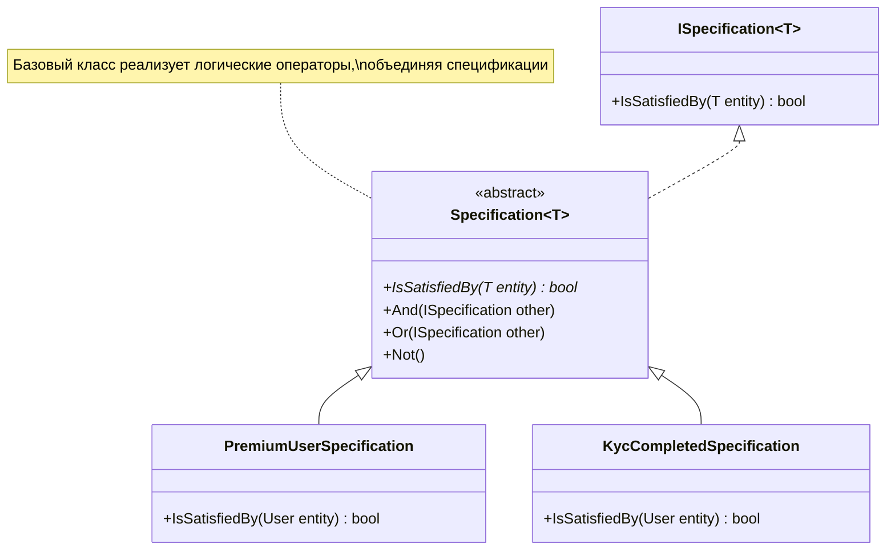

---
aliases:
  - Спецификация
tags:
  - DesignPatterns
  - dotnet
date: 2026-03-02 17:44
status:
---
### Суть 
**Проблема:** Бизнес-правила валидации или выборки объектов размазаны по коду (`if` в контроллерах, сервисах), дублируются и их сложно комбинировать.
**Решение:** Инкапсулировать каждое бизнес-правило в отдельный класс, который можно переиспользовать и соединять с другими правилами (И, ИЛИ, НЕ).

> [!example] Аналогия из жизни
> Представь **HR-рекрутера**, который фильтрует резюме. У него есть набор критериев (Спецификаций):
> 1. "Знает английский на уровне C1".
> 2. "Опыт работы > 3 лет".
> 3. "Не был судим".
>
> Рекрутер может комбинировать эти "карточки" с требованиями как угодно: для Senior-а нужны все три (AND), для Junior-а — только английский. Ему не нужно переписывать процесс найма под каждую вакансию, он просто меняет набор карточек.

---

### 🧩 Диаграмма классов

В основе лежит [[Composite Pattern]], так как спецификации могут объединяться в цепочки.



---

### Реализация

В .NET мире реализация часто включает перегрузку операторов (`&`, `|`, `!`), чтобы писать правила читаемо. Рассмотрим кейс **Банковского скоринга** (выдача кредита).

> [!info] Senior Tip
> В реальных проектах (EF Core) часто используют `Expression<Func<T, bool>>` внутри спецификации, чтобы транслировать правила сразу в SQL-запрос. Но здесь мы рассмотрим "чистую" Domain Model реализацию (In-Memory валидация).

#### 1. Базовая абстракция

```csharp
using System.Linq.Expressions;

namespace DesignPatterns.Specification;

// Абстрактный базовый класс
public abstract class Specification<T>
{
    // Метод, который проверяет, соответствует ли сущность правилу
    public abstract bool IsSatisfiedBy(T entity);

    // Перегрузка операторов для красивого синтаксиса: spec1 & spec2
    public static Specification<T> operator &(Specification<T> left, Specification<T> right)
        => new AndSpecification<T>(left, right);

    public static Specification<T> operator |(Specification<T> left, Specification<T> right)
        => new OrSpecification<T>(left, right);

    public static Specification<T> operator !(Specification<T> spec)
        => new NotSpecification<T>(spec);
}

// Реализация оператора AND
internal sealed class AndSpecification<T>(Specification<T> left, Specification<T> right) : Specification<T>
{
    public override bool IsSatisfiedBy(T entity)
        => left.IsSatisfiedBy(entity) && right.IsSatisfiedBy(entity);
}

// Реализация оператора OR
internal sealed class OrSpecification<T>(Specification<T> left, Specification<T> right) : Specification<T>
{
    public override bool IsSatisfiedBy(T entity)
        => left.IsSatisfiedBy(entity) || right.IsSatisfiedBy(entity);
}

// Реализация оператора NOT
internal sealed class NotSpecification<T>(Specification<T> spec) : Specification<T>
{
    public override bool IsSatisfiedBy(T entity)
        => !spec.IsSatisfiedBy(entity);
}
```

#### 2. Доменная модель и Правила

```csharp
// Сущность: Заявка на кредит
public record LoanApplication(
    Guid Id, 
    decimal Amount, 
    int CreditScore, 
    bool HasActiveDelinquency, // Есть ли просрочки
    int ApplicantAge
);

// Правило 1: Высокий кредитный рейтинг
public sealed class HighCreditScoreSpec : Specification<LoanApplication>
{
    private const int MinScore = 700;
    public override bool IsSatisfiedBy(LoanApplication entity) 
        => entity.CreditScore >= MinScore;
}

// Правило 2: Нет активных просрочек
public sealed class NoDelinquencySpec : Specification<LoanApplication>
{
    public override bool IsSatisfiedBy(LoanApplication entity) 
        => !entity.HasActiveDelinquency;
}

// Правило 3: Совершеннолетний, но не пенсионер (для рисковых кредитов)
public sealed class WorkingAgeSpec : Specification<LoanApplication>
{
    public override bool IsSatisfiedBy(LoanApplication entity) 
        => entity.ApplicantAge is >= 18 and < 65;
}

// Параметризованное правило: Сумма не превышает лимит
public sealed class AmountLimitSpec(decimal maxAmount) : Specification<LoanApplication>
{
    public override bool IsSatisfiedBy(LoanApplication entity) 
        => entity.Amount <= maxAmount;
}
```

#### 3. Использование (Client Code)

```csharp
public class LoanService
{
    public bool CanApproveLoan(LoanApplication application)
    {
        // Строим сложное бизнес-правило из простых кубиков
        var highCredit = new HighCreditScoreSpec();
        var cleanHistory = new NoDelinquencySpec();
        var workingAge = new WorkingAgeSpec();
        var riskyAmount = new AmountLimitSpec(1_000_000);

        // Кредит одобряем, если:
        // (Хороший рейтинг И чистая история) ИЛИ (Рабочий возраст И Сумма небольшая)
        var complexPolicy = (highCredit & cleanHistory) | (workingAge & riskyAmount);

        // Проверка
        return complexPolicy.IsSatisfiedBy(application);
    }
}

// Пример вызова
var app = new LoanApplication(Guid.NewGuid(), 500_000, 650, false, 30);
var service = new LoanService();
bool isApproved = service.CanApproveLoan(app); // True (сработает вторая часть OR)
```

---

### ✅ Когда использовать

1.  **Сложная валидация:** Когда у вас есть сущность, которую нужно проверять по десятку разных критериев в разных комбинациях.
2.  **Повторное использование:** Одно и то же правило ("Пользователь активен") нужно и при логине, и при отправке email, и при расчете скидки.
3.  **[[DDD (Domain-Driven Design)]] (Domain-Driven Design):** Когда правила являются частью Ubiquitous Language (Единого языка). Классы называются так, как говорят аналитики (`OverdueDebtSpecification`).
4.  **Фильтрация в репозиториях:** Часто используется для динамического построения `Where` условий в БД (требует адаптации под `Expression`).

### 🛑 Anti-patterns 

*   **Простые проверки:** Не создавайте класс `UserIsAdminSpec` для проверки `user.Role == "Admin"`. Это Over-engineering. Хватит простого метода или свойства.
*   **Скрытая логика:** Если спецификация лезет в базу данных или делает HTTP-запросы внутри `IsSatisfiedBy`. Спецификация должна работать только с данными переданного объекта (Pure Function).
*   **Смешивание инфраструктуры:** Не пишите SQL-код внутри спецификаций доменного уровня.

---

### 🔗 Связи

*   Часто используется вместе с [[Repository Pattern]] (для инкапсуляции логики выборки данных).
*   Структурно похож на [[Composite Pattern]] (дерево условий).
*   Является частным случаем [[Strategy Pattern]] (стратегия валидации).
*   В современных .NET проектах может заменяться на валидаторы типа **[[FluentValidation]]**, если логика не требует сложного динамического комбинирования.